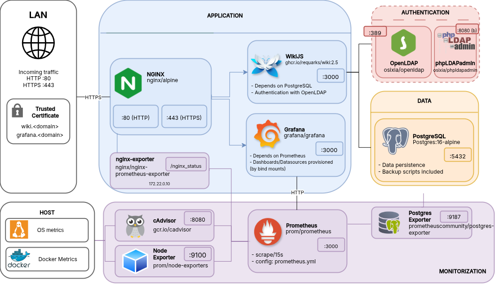
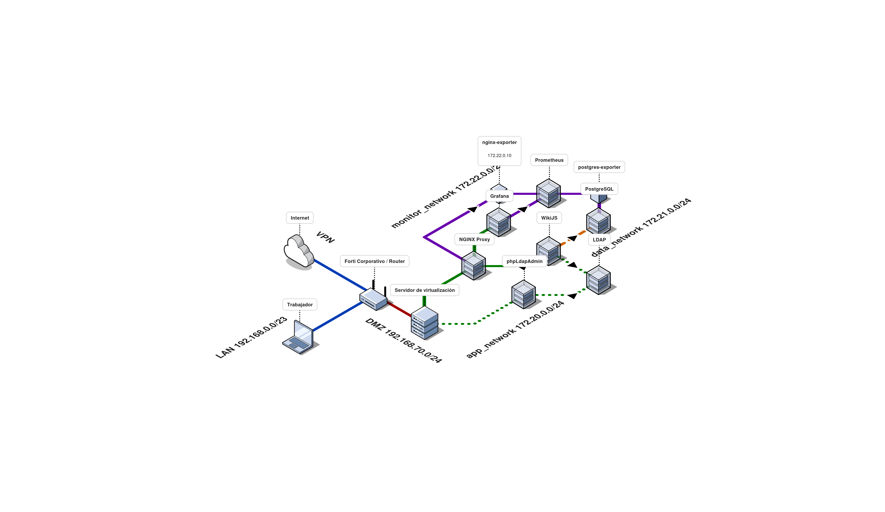

# wikijs-docker


Containerized documentation platform using Wiki.js, PostgreSQL, and NGINX. Includes HTTPS with self-signed CA, optional LDAP authentication, full observability with Prometheus and Grafana, and automated backup and restore. Deployed via Docker Compose with a single orchestration script.

---

## Architecture

### Components



Five logical components make up the stack. NGINX is the single external entry point — Wiki.js and Grafana are never exposed directly. All HTTP traffic is redirected to HTTPS at the proxy. PostgreSQL, OpenLDAP, and the full monitoring stack (Prometheus, Node Exporter, cAdvisor, and the service exporters) sit behind it.

OpenLDAP and phpLDAPadmin are optional, activated via Docker Compose profile. phpLDAPadmin is the one exception to the proxy rule — it exposes port `8081` directly on the host and is included for LDAP testing only.

### Network topology



The host sits in a DMZ (`192.168.70.0/24`) behind a corporate Forti router, with VPN access from the LAN (`192.168.0/23`). Docker runs three isolated bridge networks with distinct exposure profiles:

- `app_network` (`172.20.0.0/24`) — the only network with outbound internet access. NGINX, Wiki.js, Grafana, and the LDAP services connect here.
- `data_network` (`172.21.0.0/24`) — internal only. Isolates PostgreSQL; only Wiki.js crosses into it.
- `monitor_network` (`172.22.0.0/24`) — internal only. Prometheus scrapes all exporters here with no external reach.

`data_network` and `monitor_network` are declared `internal: true` — containers on these networks have no outbound internet access and are unreachable from outside the host.

---

## Deployment

**Prerequisites:** Docker and Docker Compose. If starting from scratch on Ubuntu, run `scripts/docker-install.sh` first.

**1. Clone the repository**

```bash
git clone https://github.com/jandarn/wikijs-docker.git
cd wikijs-docker
```

**2. Configure the environment**

```bash
cp .env.example .env
# Edit .env — set domain, passwords, and LOCAL_DB preference
```

**3. Make the deploy script executable and run it**

```bash
chmod +x deploy.sh
./deploy.sh
```

The script validates configuration, generates NGINX config, creates TLS certificates via `scripts/generate-certs.sh`, and brings up the full stack.

**4. Configure DNS**

Add entries for `wiki.<domain>` and `grafana.<domain>` pointing to the host IP — either in `/etc/hosts` or via your local DNS server. Direct IP access is not allowed; NGINX only responds to the configured domain names.

**5. Trust the Certificate Authority**

The self-signed CA is generated at `certs/ca.crt`. Import it into your OS or browser trust store to avoid certificate warnings.

**6. Access the stack**

```
https://wiki.<your-domain>
https://grafana.<your-domain>
```

To bring the stack down: `./deploy.sh down`

### Optional features

**Local PostgreSQL** — set `LOCAL_DB=true` in `.env` to run PostgreSQL as a container within the stack. Otherwise, point the DB variables at an external instance.

**LDAP** — set `LDAP_TEST=true` to start OpenLDAP and phpLDAPadmin. For testing only.

---

## Scripts

| Script | Description |
|---|---|
| `deploy.sh` | Main orchestration script — validates config, generates certs and NGINX config, and starts the full stack. Accepts `down` to stop it. |
| `scripts/backup.sh` | Creates a timestamped archive of wiki data and a PostgreSQL dump to the configured backup directory. |
| `scripts/restore.sh` | Restores wiki data and database from a backup archive. |
| `scripts/generate-certs.sh` | Generates a local CA and a signed server certificate used by NGINX for HTTPS. |
| `scripts/nginx-conf.sh` | Generates the NGINX configuration from `.env` values. Run if the domain changes after initial setup. |
| `scripts/ldap-conf.sh` | Configures OpenLDAP with base structure and test users. |
| `scripts/iptables.sh` | Applies host-level firewall rules — allows port 443, restricts everything else. |
| `scripts/docker-install.sh` | Bootstraps Docker and Docker Compose on a clean Ubuntu host. |

---

## Authors

- [@jandarn](https://github.com/jandarn)

## License

This project is licensed under the GNU General Public License v3.0 (GPL-3.0).
